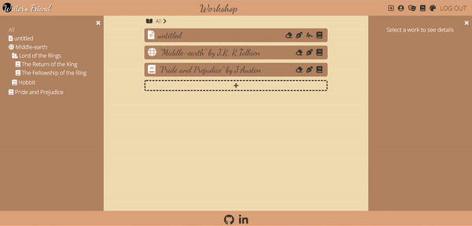
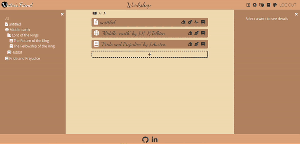
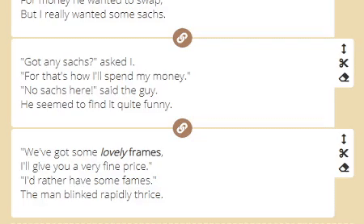

[Live on Heroku](https://writers-friend.herokuapp.com/)

## Table of Contents

1. [Introduction](#introduction)
2.  [Dependencies](#dependencies)
3.  [Features](#features)
	- [Sign-up / Login](#signup)
	- [Entities](#entities)
	- [Chapters/stories](#chapter)
	- [Scenes](#scenes)
	- [Pseudonyms](#pseudonyms)
	- [Themes](#themes)

## Introduction

`Writer's Friend` is a visual tool to improve writing experience. It will allow users to to easily navigate through their works and and edit texts.

## Dependencies

<a href="https://www.heroku.com/"></a>
<a href="https://www.npmjs.com/package/express"></a>
<a href="https://www.postgresql.org/"></a>
<a href="https://reactjs.org/"></a>
<a href="https://redux.js.org/"></a>
<a href="https://sequelize.org/"></a>
<a href="https://www.npmjs.com/package/react-beautiful-dnd"> </a>
<a href="https://draftjs.org/"></a>
<a href="https://developer.mozilla.org/en-US/docs/Web/CSS"></a>
<a href="https://developer.mozilla.org/en-US/docs/Web/HTML"></a>
<a href="https://developer.mozilla.org/en-US/docs/Web/JavaScript"></a>

## Features

- ### Sign-up / Login <a id="signup" ></a>

- ### Entities
	Users can create entities, like trees with following levels:
	1. world
	2. book series
	3. book
	4. chapter/story

	
	

	Entities are stored in Redux store as an ordered array of entities of highest level, with nested array of children-entities.
	Nesting goes up to 4 levels.

	New entity is added to the Redux store using recursion.
	```js
	export let addEntity = (entityArray, child) => {
	
		// if has no parent - add to the top level
		if (!child.parentId){
			return [...entityArray, child];
		}

		// trace path to parent entity
		let path = findPath(entityArray, child);

		// recursively copy original array
		let copyArray = (array) => {
			let newArr = [];
			for (let i = 0; i < array.length; i++) {
				let item = array[i];
				// if current entity is parent of the new entity
				// add to the end of children array
				if (item.id===child.parentId) {
					item.children = [...item.children, child];
				}
				// if current entity is on the way to the parent entity
				// enter recursion with children array 
				else if (path.includes(item.id)) {
					item.children = copyArray(item.children)
				}
				newArr.push(item);
			}
			return newArr
		}

		return copyArray(entityArray, child, path);
	}
	```
	Updating and removing of entities is solved in the similar way

- ### Chapters/stories<a id="chapter" ></a>
	`Chapters` and `stories` are leaf-entities.
	
	There are 2 ways to `create new story/chapter`:
	1. Through entity creation form:

	

	2. Pressing Start writing button - that would create story on the hiest level.

	

- ### Scenes
	- To write a text users can create several blocks of text - `scenes`.
	- Users can `re-order scenes`

		

	- Users can `join scenes`

		
	
	- Users can `split scenes`

		

	- Users can `delete scenes` after a confirmation.
	
	- All of the changes preserved in the `Redux store` unless saved.
	- Users can `reset` unsaved changes after a confirmation.

- ### Pseudonyms
	- Users can create multiple `pseudonyms`.
	- Users can set one `pseudonym` to represent as themself.

		

- ### Themes
	- User can change color theme of the app

		

	- Theme setting is preserved in cookies

	```js
	import Cookies from 'js-cookie';

	const [theme, setTheme] = useState("peach")
	// array of pre-defined themes
  	const themeList = useMemo(()=>["peach", "beach", "midnight", "dark"],[]);

	// check cookies for set theme
	useEffect(() => {
		dispatch(sessionActions.restoreUser())
		.then(() => {
			if (Cookies.get('color-theme') && themeList.includes(Cookies.get('color-theme'))) {
				setTheme(Cookies.get('color-theme'))
			} 
			else {
				Cookies.set('color-theme','peach')
			}
			setIsLoaded(true)
		});
	}, [dispatch, themeList]);

	//set theme-class to body
	useEffect(()=>{
		document.body.setAttribute("class", "")
		document.body.classList.add(theme)
	},[theme])
	```
	I used CSS variables to set colors for each theme

	```css
	.midnight {
		--bg-color1: #245579;
		--text-color1: #000;
		--text-hover1: #ffbc42;

		--bg-color2: #d81159;
		--text-color2: #333;
		--text-hover2: #ffbc42;
		
		...
	}
	```